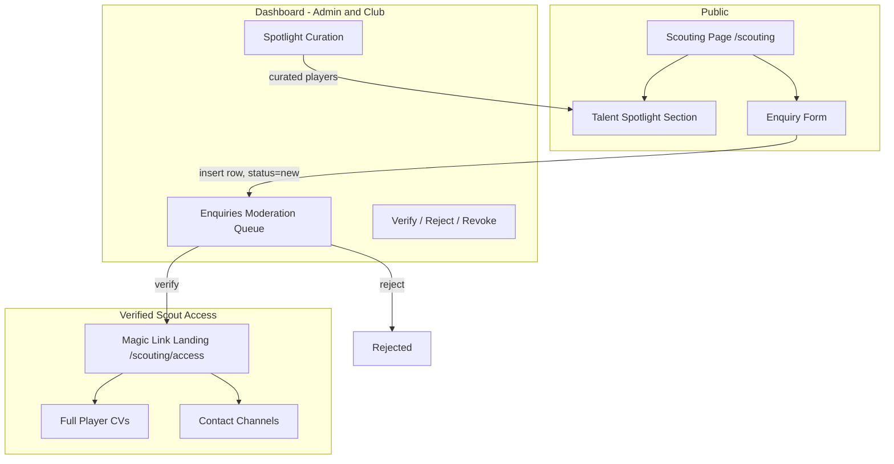

# International Scout Portal — Technical Plan

## Summary

Attract verified international scouts and clubs (Eastern Europe, Asia, North America) to Tema Royals talent. The flow inverts the original "our scouts report in" idea: Tema Royals becomes the **talent destination**. A public `/scouting` page markets the club's pipeline (talent spotlight, club credentials, transfer history). Interested scouts submit a structured enquiry; admins verify the scout (org, league, role) via a dashboard queue; **verified scouts unlock deeper access** — full player CVs, contact channels, video. Sam gets a warm-enquiry inbox with verification status instead of cold DMs.

**Core loop:** Public showcase → Enquiry form → Admin verification → Verified access → Conversation.

---

## Current State

### Already Built
- **Next.js 15 App Router** with `[locale]` routing and 6 locales (en, es, fr, pt, ar, sw) via `messages/*.json`
- **Supabase live mode**: 8 tables with RLS, 5 roles (admin, club, creator, player, fan), `has_role()` / `has_editor_access()` / `is_admin()` helpers
- **Moderation pattern**: `player_submissions` queue → dashboard review → approve/reject (plan: `player-registration-moderation.md`)
- **Storage**: `registration-uploads` bucket with RLS + `image-upload-field.tsx` component
- **Dashboard framework**: `dashboard-config.ts` role-based sidebar sections
- **Public pages**: players, staff, fixtures, partnership — shared site chrome

### What Needs Building
- `scout_enquiries` table (the verification queue)
- `talent_spotlight` table (admin-curated players shown to scouts)
- Public `/scouting` page — bilingual-ready marketing + enquiry form
- `scout_access_tokens` — magic-link style access for verified scouts (no full accounts in Phase 1)
- Dashboard "Scouting" section — enquiries moderation + spotlight curation
- Email notifications to club on new enquiry (Resend, pattern from Gold Coast Grange)
- i18n strings for all 6 locales (scout-facing copy English-first; locales follow)

---

## Architecture Overview



---

## Phase 1: Database Schema

### 1.1 `scout_enquiries` — Verification Queue

```sql
CREATE TABLE public.scout_enquiries (
  id UUID PRIMARY KEY DEFAULT gen_random_uuid(),
  full_name TEXT NOT NULL,
  email TEXT NOT NULL,
  organisation TEXT NOT NULL,          -- club, agency, network
  country TEXT NOT NULL,               -- target markets: PL, UA, CZ, JP, KR, US, CA...
  role TEXT NOT NULL,                  -- chief scout, agent, sporting director...
  league_or_level TEXT,                -- e.g. "Ekstraklasa", "J1 League", "MLS"
  website_or_linkedin TEXT,
  regions_of_interest TEXT[],          -- e.g. {Ghana, West Africa}
  message TEXT,
  status TEXT NOT NULL DEFAULT 'new'
    CHECK (status IN ('new','in_review','verified','rejected','revoked')),
  reviewer_id UUID REFERENCES public.profiles(id),
  review_notes TEXT,
  created_at TIMESTAMPTZ DEFAULT now(),
  updated_at TIMESTAMPTZ DEFAULT now()
);

ALTER TABLE public.scout_enquiries ENABLE ROW LEVEL SECURITY;
```

**RLS:** anon can INSERT (the form); only admin/club can SELECT/UPDATE.

### 1.2 `scout_access_tokens` — Verified Access (no accounts)

```sql
CREATE TABLE public.scout_access_tokens (
  token TEXT PRIMARY KEY,              -- 32-byte urlsafe random
  enquiry_id UUID REFERENCES public.scout_enquiries(id) ON DELETE CASCADE,
  expires_at TIMESTAMPTZ NOT NULL,     -- default 90 days, renewable
  revoked BOOLEAN DEFAULT false,
  created_at TIMESTAMPTZ DEFAULT now()
);
```

**RLS:** no anon access; validated server-side only (route handlers compare hash).

### 1.3 `talent_spotlight` — Curated Showcase

```sql
CREATE TABLE public.talent_spotlight (
  id UUID PRIMARY KEY DEFAULT gen_random_uuid(),
  player_id UUID REFERENCES public.players(id) ON DELETE CASCADE,
  headline TEXT,                       -- "Ghana U20 int. — pacey inverted winger"
  is_active BOOLEAN DEFAULT true,
  display_order INT DEFAULT 0,
  created_at TIMESTAMPTZ DEFAULT now()
);
```

**RLS:** public SELECT where `is_active`; admin/club full access. Player contact/agent fields are **not** on public players table rows exposed here.

---

## Phase 2: Public `/scouting` Page

Mobile-first (`/[locale]/scouting`), house chrome (hamburger + CTA):

1. **Hero** — "Scouting Ghana's Next Generation" + region badges (Eastern Europe · Asia · North America)
2. **Why Tema Royals** — club credentials, academy pipeline, transfer readiness
3. **Talent Spotlight** — active spotlight players (name, position, age, key attributes; no contact data)
4. **How it works** — 3 steps: Enquire → Verification → Access
5. **Enquiry form** — fields mirror `scout_enquiries`; server action inserts row + triggers email

---

## Phase 3: Verification & Access Flow

- Dashboard queue lists `new` enquiries with org/league/country cards
- Admin verifies → generates `scout_access_tokens` row → emails magic link
- Magic link (`/scouting/access?token=…`) → server validates token → renders verified view: full CVs, video links, contact channel (club email/WhatsApp via Sam)
- Revoke = flip `revoked` → link dies instantly
- Rate-limit form submissions per IP (Upstash-style in-memory for Phase 1)

---

## Phase 4: Dashboard Section

Add "Scouting" to `dashboard-config.ts` (admin + club roles):
- **Enquiries** — queue with status pills, reviewer notes, verify/reject/revoke actions
- **Spotlight** — pick players, set headline + order, toggle active

---

## Phase 5: i18n

- Scout-facing copy authored in English; strings added to all 6 `messages/*.json`
- Future locales (pl, ru, ja) only if enquiry volume justifies — English is the scouting lingua franca

## Phase 6: Email Notifications

- New enquiry → email Sam/admins via Resend (reuse GCG pattern + lisa-mail-api :8084 if simpler)
- Verification decision → email scout their magic link (or rejection politely)

---

## Security & Privacy

- Player personal contact/agent details never on public tables; only via verified token view
- Tokens hashed at rest, 90-day expiry, instant revoke
- Form spam protection: honeypot + IP rate limit + optional hCaptcha later
- `scout_enquiries` PII (names/emails) visible only to admin/club

## Out of Scope (Future Stages)

- Full scout accounts with saved shortlists
- Private video rooms (match footage per position) — needs storage tier
- Trial invitation scheduling
- Transfer CV PDF export per player
- Scout analytics (which players get viewed)

---

## Build Order

1. SQL schema + RLS (docs/supabase/ migration file)
2. `/scouting` public page + form server action
3. Dashboard section + verification actions
4. Magic-link access view
5. Email notifications
6. i18n strings + polish
