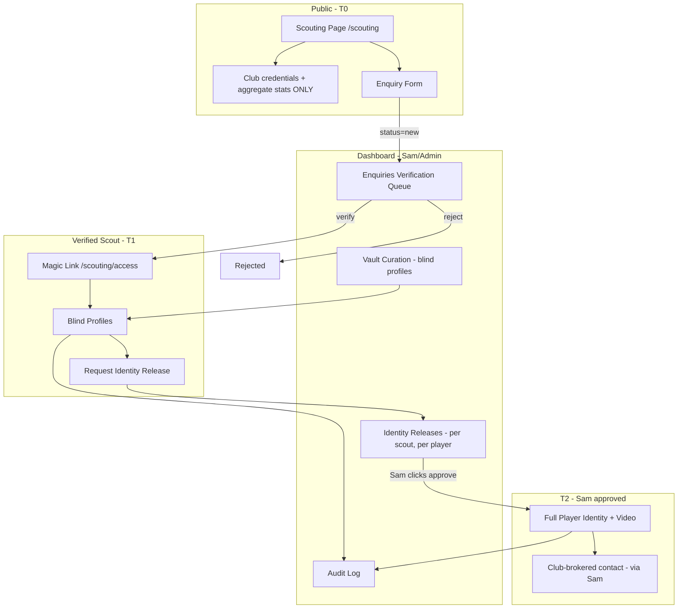

# International Scout Portal — Technical Plan (v2 — Trust-First)

## Summary

Attract verified international scouts and clubs (Eastern Europe, Asia, North America) to Tema Royals talent — **without exposing player identities publicly**. Sam's rule: no player details on the public site, ever. The portal therefore sells the **pipeline, not the players**: a public `/scouting` page shows only club credentials and aggregate numbers ("23 academy players, 4 Ghana youth internationals"). Everything player-specific lives in a gated **Talent Vault**. Verified scouts see **blind profiles** (alias, position, attributes — no name, no face). Full identity is released **per scout, per player, only by Sam's manual approval**, and all contact is **club-brokered** — scouts never receive player phone numbers or direct contact.

**Core loop:** Public credentials → Enquiry → Admin verification → Blind vault access → Sam approves identity release per player → Club-brokered conversation.

---

## Why This Shape (The Trust Architecture)

Sam's fear, honored as a design constraint:

1. **Poaching bypass** — can't contact what you can't identify. Public site has zero player data to scrape.
2. **Minor safety** — academy kids are protected behind verification + consent gates; no public faces.
3. **Club leverage** — the club is always the broker. No scout-player side channel. Transfer discussions route through Sam.
4. **Sam's finger on the switch** — nothing is visible to any scout without Sam's click; anything can be revoked instantly.
5. **Consent on record** — a player only enters the vault after consent (guardian co-consent if minor) is logged; withdrawal removes them everywhere.

### Data Visibility Tiers

| Tier | Who sees it | What they see |
|---|---|---|
| **T0 — Public** | Everyone | Club credentials, aggregate counts, success stories. **No names, photos, ages, or stats of individuals.** |
| **T1 — Verified scout** | Magic-link holders Sam approved | Blind profiles: alias ("W-07"), position, age band (18–20), attribute ratings, masked match clip links |
| **T2 — Identity release** | Per scout, per player, Sam's manual click | Real name, full DOB, club history, full video, availability status |
| **T3 — Contact** | Never exposed | All introductions via Sam's official channel (club email/WhatsApp). Player contact details stay in the club's private records only. |

---

## Current State

### Already Built
- **Next.js 15 App Router** with `[locale]` routing and 6 locales (en, es, fr, pt, ar, sw) via `messages/*.json`
- **Supabase live mode**: 8 tables with RLS, 5 roles (admin, club, creator, player, fan), `has_role()` / `has_editor_access()` / `is_admin()` helpers
- **Moderation pattern**: `player_submissions` queue → dashboard review → approve/reject (plan: `player-registration-moderation.md`)
- **Storage**: `registration-uploads` bucket with RLS + `image-upload-field.tsx` component
- **Dashboard framework**: `dashboard-config.ts` role-based sidebar sections
- **Public pages**: players, staff, fixtures, partnership — shared site chrome

### What Needs Building
- `scout_enquiries` table (verification queue)
- `vault_players` — blind-profile mirror of squad (public `players` table stays untouched)
- `vault_consent` — player/guardian consent records
- `identity_releases` — per-scout, per-player T2 grants (Sam-only)
- `scout_access_tokens` — magic-link access for verified scouts
- `vault_audit_log` — who viewed what, when
- Public `/scouting` page — credentials marketing + enquiry form (T0 content only)
- Dashboard "Scouting" section — enquiries, vault curation, releases, audit
- Email notifications (Resend / lisa-mail-api pattern)
- i18n strings for all 6 locales

---

## Architecture Overview



---

## Phase 1: Database Schema

### 1.1 `scout_enquiries` — Verification Queue

```sql
CREATE TABLE public.scout_enquiries (
  id UUID PRIMARY KEY DEFAULT gen_random_uuid(),
  full_name TEXT NOT NULL,
  email TEXT NOT NULL,
  organisation TEXT NOT NULL,
  country TEXT NOT NULL,
  role TEXT NOT NULL,
  league_or_level TEXT,
  website_or_linkedin TEXT,
  message TEXT,
  status TEXT NOT NULL DEFAULT 'new'
    CHECK (status IN ('new','in_review','verified','rejected','revoked')),
  reviewer_id UUID REFERENCES public.profiles(id),
  review_notes TEXT,
  created_at TIMESTAMPTZ DEFAULT now(),
  updated_at TIMESTAMPTZ DEFAULT now()
);
ALTER TABLE public.scout_enquiries ENABLE ROW LEVEL SECURITY;
```

RLS: anon INSERT only; admin/club SELECT/UPDATE.

### 1.2 `scout_access_tokens` — Magic Links

```sql
CREATE TABLE public.scout_access_tokens (
  token TEXT PRIMARY KEY,              -- 32-byte urlsafe random, stored hashed
  enquiry_id UUID REFERENCES public.scout_enquiries(id) ON DELETE CASCADE,
  expires_at TIMESTAMPTZ NOT NULL,     -- 90 days, renewable
  revoked BOOLEAN DEFAULT false,
  created_at TIMESTAMPTZ DEFAULT now()
);
```

RLS: no anon access; validated server-side only.

### 1.3 `vault_players` — Blind Profiles (T1 data)

```sql
CREATE TABLE public.vault_players (
  id UUID PRIMARY KEY DEFAULT gen_random_uuid(),
  real_player_id UUID REFERENCES public.players(id) ON DELETE CASCADE, -- NEVER exposed via API
  alias TEXT NOT NULL UNIQUE,          -- "W-07", "CM-03"
  position TEXT NOT NULL,
  age_band TEXT NOT NULL,              -- "18-20", "21-23" (no exact DOB at T1)
  foot TEXT,
  height_band TEXT,                    -- bands, not cm
  attributes JSONB,                    -- {pace: 88, finishing: 76, ...}
  headline TEXT,                       -- "Ghana U18 trials standout"
  video_urls TEXT[],                   -- unlisted/masked clip links
  availability TEXT DEFAULT 'open_to_moves',
  is_active BOOLEAN DEFAULT true,
  created_at TIMESTAMPTZ DEFAULT now()
);
```

RLS: public SELECT **only via server-side vault route** after token validation (table itself locked to anon; served through a server action that strips `real_player_id`).

### 1.4 `vault_consent` — Player/Guardian Consent

```sql
CREATE TABLE public.vault_consent (
  id UUID PRIMARY KEY DEFAULT gen_random_uuid(),
  vault_player_id UUID REFERENCES public.vault_players(id) ON DELETE CASCADE,
  consent_type TEXT NOT NULL CHECK (consent_type IN ('player','guardian')),
  consented_by_name TEXT NOT NULL,
  consented_at TIMESTAMPTZ DEFAULT now(),
  notes TEXT,                          -- verbal/written, witness
  withdrawn_at TIMESTAMPTZ
);
```

A vault profile is only servable when consent rows are valid (not withdrawn). Guardian row REQUIRED if age band is minor (under 18).

### 1.5 `identity_releases` — T2 Grants (Sam-only)

```sql
CREATE TABLE public.identity_releases (
  id UUID PRIMARY KEY DEFAULT gen_random_uuid(),
  vault_player_id UUID REFERENCES public.vault_players(id) ON DELETE CASCADE,
  enquiry_id UUID REFERENCES public.scout_enquiries(id) ON DELETE CASCADE,
  released_by UUID REFERENCES public.profiles(id),  -- must be admin
  scope TEXT NOT NULL DEFAULT 'full',               -- full identity + video
  expires_at TIMESTAMPTZ,                           -- optional time-box
  revoked_at TIMESTAMPTZ,
  created_at TIMESTAMPTZ DEFAULT now(),
  UNIQUE (vault_player_id, enquiry_id)
);
```

RLS: admin-only INSERT/UPDATE. Servable only when `revoked_at IS NULL` and not expired.

### 1.6 `vault_audit_log`

```sql
CREATE TABLE public.vault_audit_log (
  id BIGSERIAL PRIMARY KEY,
  enquiry_id UUID REFERENCES public.scout_enquiries(id) ON DELETE SET NULL,
  vault_player_id UUID REFERENCES public.vault_players(id) ON DELETE SET NULL,
  action TEXT NOT NULL,                -- viewed_blind, requested_release, viewed_identity
  created_at TIMESTAMPTZ DEFAULT now()
);
```

RLS: admin-only SELECT; INSERT via server actions only.

---

## Phase 2: Public `/scouting` Page (T0 only)

Mobile-first (`/[locale]/scouting`), house chrome (hamburger + CTA):

1. **Hero** — "Scouting Ghana's Next Generation" + region badges (Eastern Europe · Asia · North America)
2. **Why Tema Royals** — club credentials, academy pipeline, transfer readiness, federation affiliation
3. **The Vault (teaser)** — aggregate only: "23 academy players · 4 Ghana youth internationals · positions available: GK, CB, CM, W" (numbers Sam edits in dashboard; computed from nothing public)
4. **How it works** — Enquire → Verification → Blind vault → Club-brokered contact
5. **Enquiry form** — mirrors `scout_enquiries`; honeypot + IP rate limit

`noindex` meta on everything except the landing page.

---

## Phase 3: Verification & Vault Access

- Dashboard queue: org/league/country cards, verify/reject/revoke
- Verify → token generated (hashed at rest) → magic link emailed
- `/scouting/access?token=…` → server validates token (not revoked, not expired) → renders blind profiles (T1). `real_player_id` never leaves the server.
- Scout clicks "Request identity release" on a blind profile → creates pending request → Sam approves in dashboard → T2 view unlocks for that scout only (name, full DOB, history, full video)
- Contact block on T2: "Arrange a conversation via the club" → routes to Sam's channel. No player contact data rendered anywhere.

---

## Phase 4: Dashboard Section

Add "Scouting" to `dashboard-config.ts` (admin + club):
- **Enquiries** — verification queue
- **Vault** — create/edit blind profiles (alias generator), toggle active, link consent records
- **Consent** — log player/guardian consent, withdrawals (withdraw = profile instantly unservable)
- **Releases** — pending requests + active releases, one-click revoke
- **Audit** — view log: which scout viewed which profile, when

---

## Phase 5: i18n + Email

- Scout-facing copy English-first; strings added to all 6 `messages/*.json`
- New enquiry → email Sam/admins (Resend or lisa-mail-api :8084)
- Verification decision → magic link email; rejection politely

---

## Security & Privacy

- Zero player-identifying data at T0/T1 — aggregate numbers only, and only what Sam types
- `vault_players.real_player_id` stripped server-side; never sent to client at T1
- Tokens hashed at rest, 90-day expiry, instant revoke
- Consent enforcement in the serving layer (not just UI)
- Audit log on every vault view
- Rate limit + honeypot on enquiry form
- `noindex` on access pages; unlisted video hosting only
- Future: per-scout forensic watermarking on released video

## Out of Scope (Future Stages)

- Full scout accounts with saved shortlists
- Per-position private video rooms
- Trial invitation scheduling
- Transfer CV PDF export
- Scout analytics dashboard

---

## Build Order

1. SQL schema + RLS (docs/supabase/ migration)
2. `/scouting` public page + enquiry form
3. Dashboard: enquiries + verification
4. Vault: blind profiles + magic-link access + audit
5. Identity releases + consent enforcement
6. Emails + i18n polish
