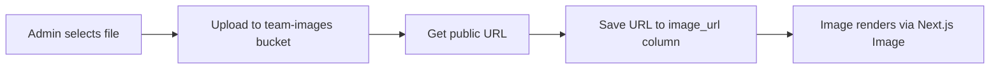

# Plan: Migrate Image Handling to Supabase Storage

## Problem

The dashboard currently uses plain text URL inputs for images on players, staff, owners, and partnerships. Admins must paste external URLs (often placeholder services like `placehold.co` or `picsum.photos`). This is fragile, depends on third-party services, and provides no upload UX.

## Goal

Replace URL text inputs with file upload controls that store images in Supabase Storage buckets. The `image_url` / `logo_url` columns in the database remain — they will now hold Supabase Storage public URLs instead of external URLs.

## Current State

- **Registration flow** already uses Supabase Storage (`registration-uploads` bucket) — see [`src/app/register/page.tsx`](src/app/register/page.tsx:199)
- **Dashboard CRUD** uses `<Input>` text fields for URLs in:
  - [`players-section.tsx`](src/app/dashboard/components/players-section.tsx:63) — `pImageUrl` state
  - [`staff-section.tsx`](src/app/dashboard/components/staff-section.tsx:51) — `sImageUrl` state
  - [`owners-section.tsx`](src/app/dashboard/components/owners-section.tsx:57) — `oImageUrl` state
  - [`partnerships-ui.tsx`](src/app/dashboard/components/partnerships-ui.tsx) — `logoUrl` state
- **Existing bucket**: `registration-uploads` with permissive RLS (anyone can upload, public read)
- **Next.js config** in [`next.config.ts`](next.config.ts:8) only allows `placehold.co`, `images.unsplash.com`, `picsum.photos`

## Architecture

### Bucket Strategy: Single bucket with folder prefixes

```
team-images/
  players/{record-id}/{timestamp}.{ext}
  staff/{record-id}/{timestamp}.{ext}
  owners/{record-id}/{timestamp}.{ext}
  partners/{record-id}/{timestamp}.{ext}
```

One public bucket `team-images` is simpler to manage than four separate buckets. The folder prefix provides logical separation and makes RLS rules easy to write if needed later.

### Data Flow



### RLS Policies

| Operation | Who | Condition |
|-----------|-----|-----------|
| SELECT | Public - anon + authenticated | `bucket_id = team-images` |
| INSERT | Admin + Club roles only | `bucket_id = team-images` AND caller has admin/club role |
| UPDATE | Admin + Club roles only | `bucket_id = team-images` AND caller has admin/club role |
| DELETE | Admin + Club roles only | `bucket_id = team-images` AND caller has admin/club role |

### File Constraints

- **Max file size**: 5 MB
- **Allowed MIME types**: `image/jpeg`, `image/png`, `image/webp`
- **Naming**: `{timestamp}-{random}.{ext}` to avoid collisions

## Implementation Steps

### 1. Supabase: Create bucket and RLS policies

Apply a migration to create the `team-images` bucket and set up RLS policies:

```sql
-- Create the bucket
INSERT INTO storage.buckets (id, name, public, file_size_limit, allowed_mime_types)
VALUES (
  'team-images',
  'team-images',
  true,
  5242880,  -- 5 MB
  ARRAY['image/jpeg', 'image/png', 'image/webp']
);

-- Public read access
CREATE POLICY "Public read team images"
ON storage.objects FOR SELECT
USING (bucket_id = 'team-images');

-- Admin/Club upload
CREATE POLICY "Admin and club can upload team images"
ON storage.objects FOR INSERT
TO authenticated
WITH CHECK (
  bucket_id = 'team-images'
  AND EXISTS (
    SELECT 1 FROM public.profiles
    WHERE id = auth.uid() AND role IN ('admin', 'club')
  )
);

-- Admin/Club update
CREATE POLICY "Admin and club can update team images"
ON storage.objects FOR UPDATE
TO authenticated
USING (
  bucket_id = 'team-images'
  AND EXISTS (
    SELECT 1 FROM public.profiles
    WHERE id = auth.uid() AND role IN ('admin', 'club')
  )
);

-- Admin/Club delete
CREATE POLICY "Admin and club can delete team images"
ON storage.objects FOR DELETE
TO authenticated
USING (
  bucket_id = 'team-images'
  AND EXISTS (
    SELECT 1 FROM public.profiles
    WHERE id = auth.uid() AND role IN ('admin', 'club')
  )
);
```

### 2. Update `next.config.ts`

Add the Supabase storage domain to `remotePatterns`:

```ts
{
  protocol: 'https',
  hostname: 'pianuabczoyqrxnfrbvv.supabase.co',
  port: '',
  pathname: '/storage/v1/object/public/**',
}
```

### 3. Create shared upload helper

New file: `src/lib/upload-image.ts`

A utility function that:
1. Takes a `File`, bucket name, and folder prefix
2. Generates a unique file path
3. Uploads to Supabase Storage
4. Returns the public URL

```ts
export async function uploadImage(
  supabase: SupabaseClient,
  file: File,
  folder: string
): Promise<{ url: string | null; error: string | null }>
```

This mirrors the existing pattern in [`src/app/register/page.tsx`](src/app/register/page.tsx:199) but is reusable.

### 4. Create `ImageUploadField` component

New file: `src/components/image-upload-field.tsx`

A reusable client component that:
- Shows a file input with drag-and-drop area
- Shows a preview of the current image (from existing URL or newly selected file)
- Manages local `File | null` state
- Exposes the selected file to the parent form via a callback
- Falls back to showing the existing URL-based image when no new file is selected

Props:
```ts
type ImageUploadFieldProps = {
  currentUrl: string | null;
  onFileSelected: (file: File | null) => void;
  label?: string;
}
```

### 5. Update dashboard section components

For each of the four sections, replace the URL `<Input>` with the new `<ImageUploadField>`:

| File | State variable | Change |
|------|---------------|--------|
| [`players-section.tsx`](src/app/dashboard/components/players-section.tsx:63) | `pImageUrl` → `pImageFile` | Replace `<Input>` with `<ImageUploadField>` |
| [`staff-section.tsx`](src/app/dashboard/components/staff-section.tsx:51) | `sImageUrl` → `sImageFile` | Replace `<Input>` with `<ImageUploadField>` |
| [`owners-section.tsx`](src/app/dashboard/components/owners-section.tsx:57) | `oImageUrl` → `oImageFile` | Replace `<Input>` with `<ImageUploadField>` |
| [`partnerships-ui.tsx`](src/app/dashboard/components/partnerships-ui.tsx) | `logoUrl` → `logoFile` | Replace `<Input>` with `<ImageUploadField>` |

### 6. Update mutation functions

The mutation files don't need to change their signatures — the upload happens in the component before calling the mutation. The flow becomes:

1. Component collects `File` from `ImageUploadField`
2. Component calls `uploadImage()` to upload to storage and get URL
3. Component passes the resulting URL to the existing mutation function

This keeps the mutation layer clean and focused on DB operations.

### 7. Update `docs/images.md`

Update the implementation notes to reflect that player/staff/owner/partner images now go through Supabase Storage uploads rather than manual URL entry.

## Files Changed Summary

| File | Action |
|------|--------|
| Supabase migration | New — create `team-images` bucket + RLS |
| [`next.config.ts`](next.config.ts) | Edit — add Supabase storage domain |
| `src/lib/upload-image.ts` | New — shared upload helper |
| `src/components/image-upload-field.tsx` | New — reusable upload component |
| [`src/app/dashboard/components/players-section.tsx`](src/app/dashboard/components/players-section.tsx) | Edit — use ImageUploadField |
| [`src/app/dashboard/components/staff-section.tsx`](src/app/dashboard/components/staff-section.tsx) | Edit — use ImageUploadField |
| [`src/app/dashboard/components/owners-section.tsx`](src/app/dashboard/components/owners-section.tsx) | Edit — use ImageUploadField |
| [`src/app/dashboard/components/partnerships-ui.tsx`](src/app/dashboard/components/partnerships-ui.tsx) | Edit — use ImageUploadField |
| [`docs/images.md`](docs/images.md) | Edit — update implementation notes |

## What Stays the Same

- The `image_url` / `logo_url` text columns in the database — they now store Supabase Storage public URLs
- The public-facing pages that render images — they already read `image_url` and pass it to `<Image>`
- The registration upload flow — it already uses Supabase Storage correctly
- The `registration-uploads` bucket — untouched, continues to serve registration submissions
